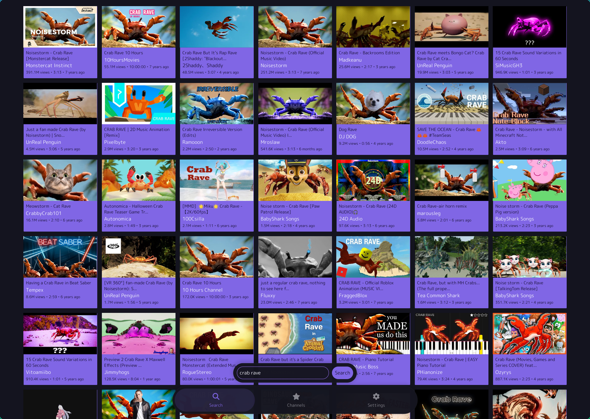
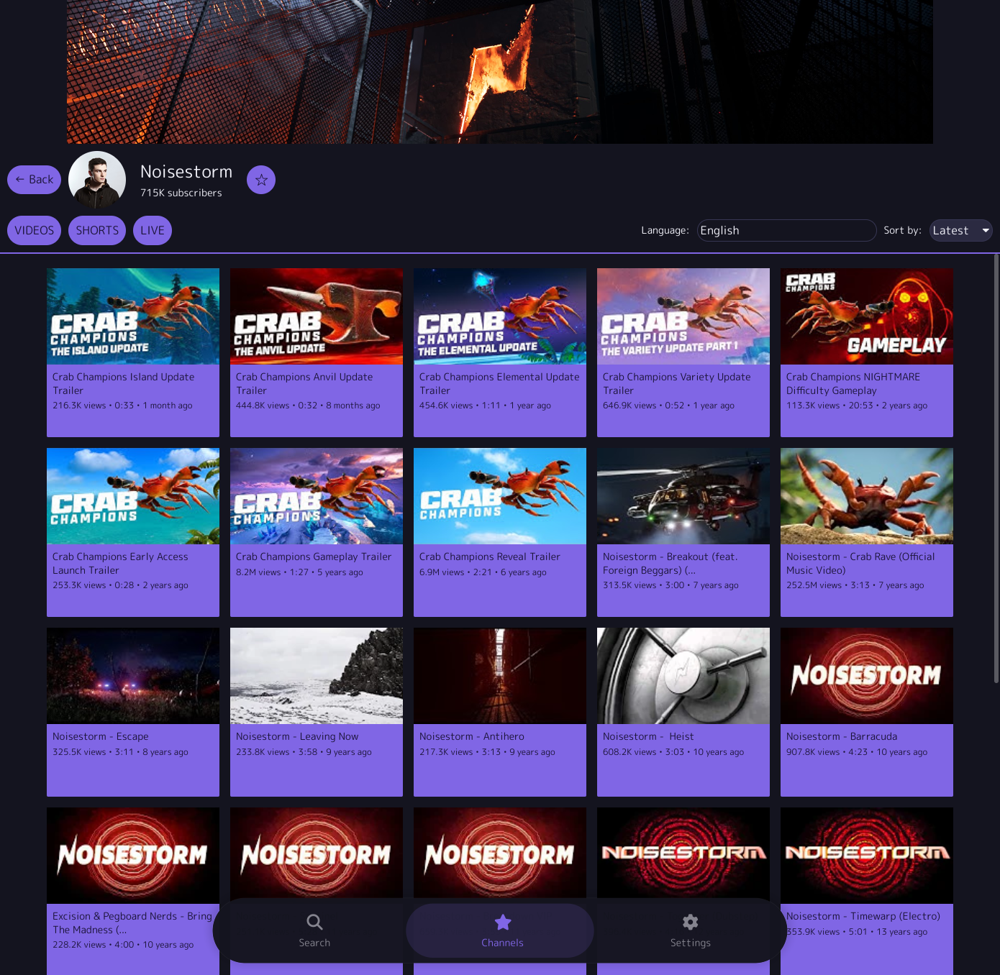
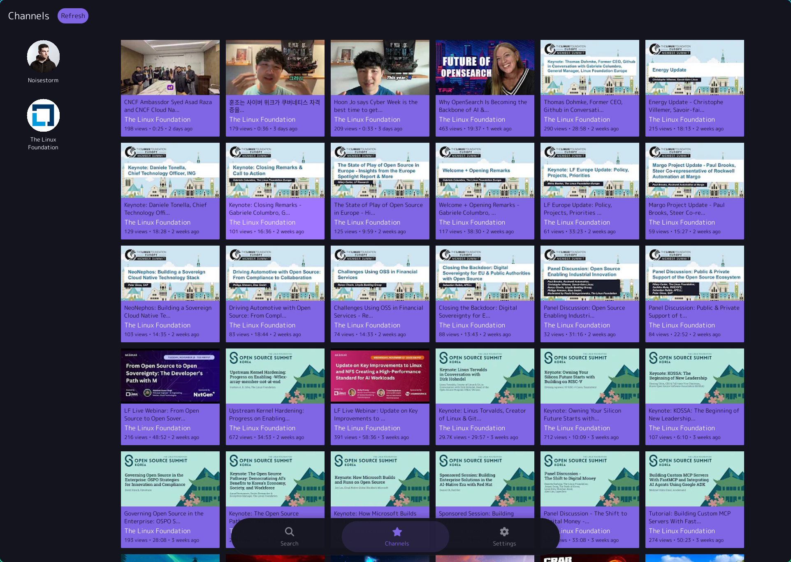
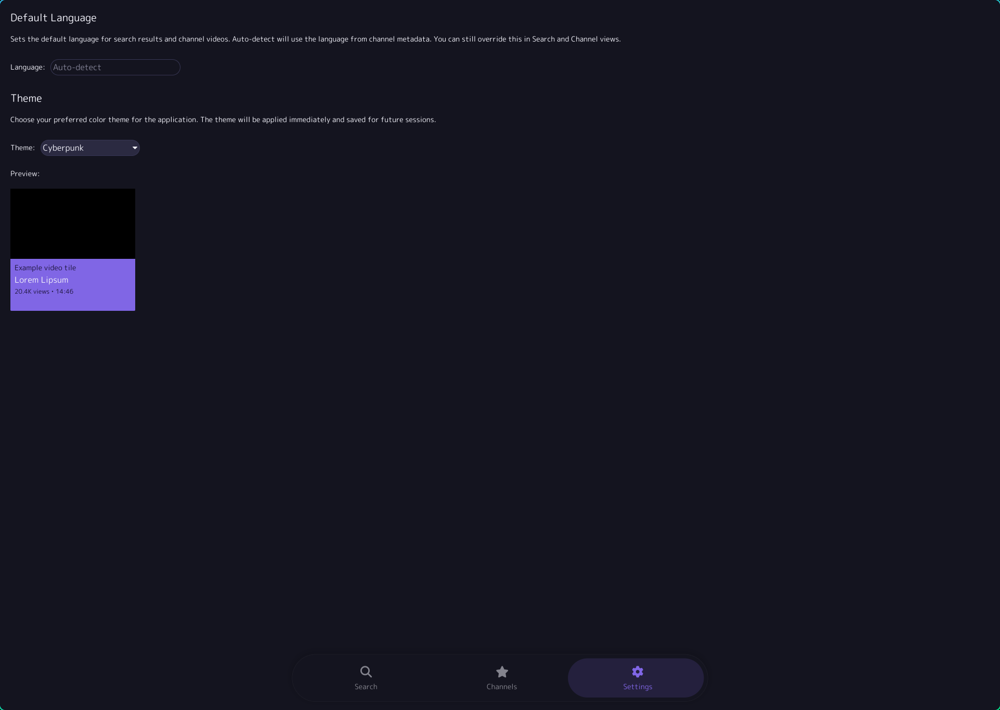
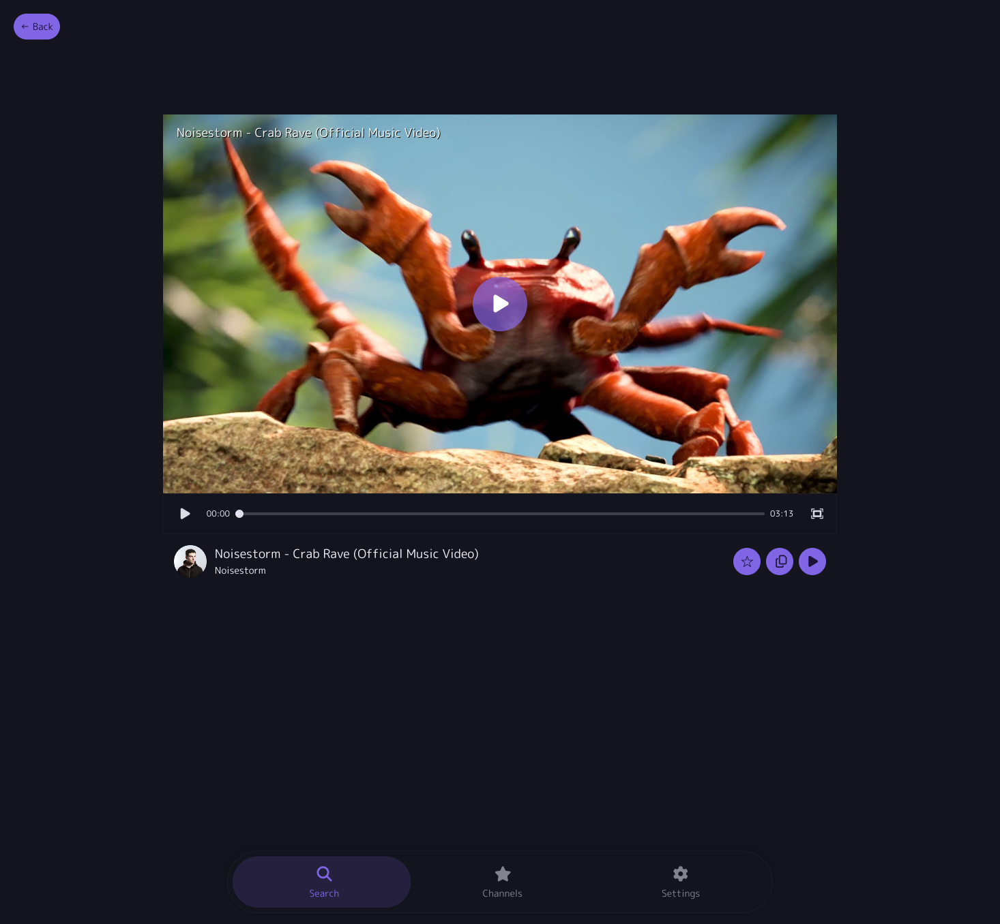
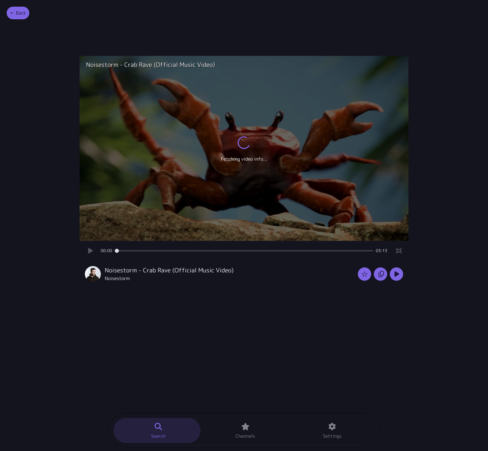
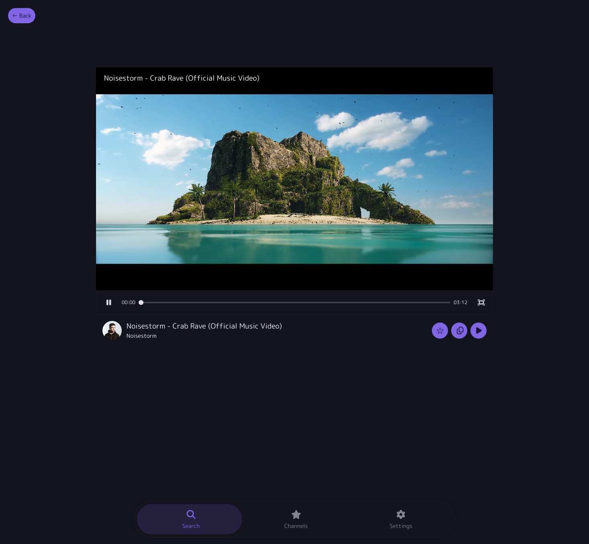

# Snowtube
An online stream player for consolidating services such as Youtube and Peertube in a single pane of glass.

Originally built to solve a specific problem: watching YouTube content in its original language.

## Features
- Cross-service search with ability to override locale, right in the search field, using `loc:<locale>`. Eg. `loc:jp`.
- View channels and sort channel videos. Override the locale setting of a specific channel and all it's content.
- Subscribe to channels. Get a single overview off all the most recent videos of your favourite channels.
- Watch videos, or enable audio mode to just listen to the audio track. Spice up your audio listening with music visualisers.

## Why?
Services such as Youtube use Auto-translation that often replaces original titles with poor machine translations. If you're multilingual, this makes discovering content in specific languages frustrating.

**Limitations:** YouTube still uses your IP location for some results regardless of locale settings.

## Other
- Built with [Iced](https://iced.rs/).
- Embedded video player using iceplayer (GStreamer based, forked from [iced_video_player](https://github.com/jazzfool/iced_video_player))
- Keyboard shortcuts for video playback:
  - `Space` - play/pause
  - `Arrow Left/Right` - seek backward/forward 5 seconds
  - `F` - toggle fullscreen
  - `Escape` or `Q` - exit fullscreen
- Everything is stored locally, including subscripionts.
- Responsive layout
- Theme selection (16 themes including Catppuccin, Tokyo Night, Gruvbox, and more)

**Requirements:** 
- GStreamer for video playback. 
- (Optional) MPV if you want to use the `Open in MPV` functionality

### ytrs-lib (YouTube)

Originally based on [YouTube.JS](https://github.com/LuanRT/YouTube.js/).

Rust client library for YouTube's private InnerTube API.

**Usage:**

```rust
use ytrs_lib::InnerTube;

#[tokio::main]
async fn main() -> Result<(), Box<dyn std::error::Error>> {
    let client = InnerTube::new().await?;
    let results = client.search("rust programming").await?;

    for video in results.results {
        println!("{}", video.title);
    }

    Ok(())
}
```

**Requirements:** [yt-dlp](https://github.com/yt-dlp/yt-dlp) and GStreamer for video playback

### ptrs-lib (PeerTube)

Rust client library for [PeerTube](https://joinpeertube.org/)'s REST API using [SepiaSearch](https://sepiasearch.org/) for federated search across instances.

**Usage:**

```rust
use ptrs_lib::PeerTubeClient;

#[tokio::main]
async fn main() -> Result<(), Box<dyn std::error::Error>> {
    let client = PeerTubeClient::new()?;
    let results = client.search("rust programming").await?;

    for video in results.results {
        println!("{}", video.title);
    }

    Ok(())
}
```


## Screenshots

### Search View

### Channel View

### Channels View

### Settings View

### Video View




## Dependencies

**GStreamer:** Follow the [GStreamer installation instructions](https://github.com/sdroege/gstreamer-rs#installation) for your platform. You'll also need `glib` and `glib-networking` (for TLS support).

**yt-dlp:** Package repositories often have outdated versions. Consider following the [official installation instructions](https://github.com/yt-dlp/yt-dlp#installation).

**mpv (optional):** For the "Open in mpv" button. Install from [mpv.io](https://mpv.io/installation/).

### Building

```bash
cargo build --release
```

Run the client:
```bash
cargo run -p ytrs-client
```

## Status

Work in progress. Maintained for personal use. Contributions are welcome.

This project is maintained at [Codeberg](https://codeberg.org/mikklee/ytrs) but mirrored to [Github](https://github.com/mikklee/ytrs) for disoverability.

## Development

Parts of this project were built with AI assistance (Claude). Code is reviewed and understood before committing.
